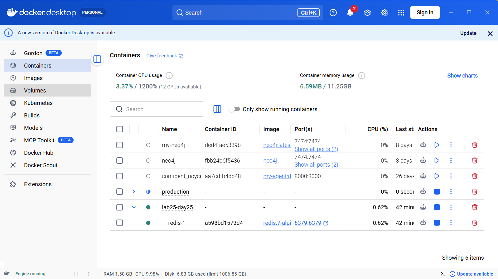
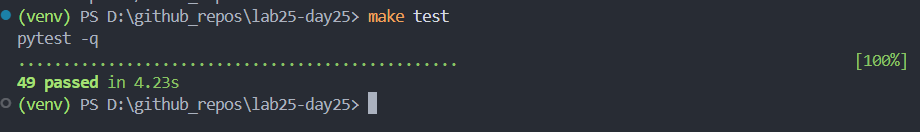

# Day 10 Reliability Report

## 1. Architecture summary

The **ReliabilityGateway** accepts a user prompt, checks an optional **response cache** (in-memory `ResponseCache` or `SharedRedisCache` backed by Redis-compatible storage), then walks a **fallback chain** of fake LLM providers. Each provider sits behind its own **circuit breaker** (CLOSED → OPEN → HALF_OPEN → CLOSED): failures increment toward `failure_threshold`; when OPEN, calls fail fast until `reset_timeout_seconds` allows a HALF_OPEN probe. On success the gateway records `primary:{name}` or `fallback:{name}` routes; cache hits return `cache_hit:{score}`. If every provider is unavailable, the gateway returns a **static fallback** message. Optional **cost budget** can block further provider spend after a cumulative threshold.

```
User Request
    |
    v
[Gateway] ---> [Cache check] ---> HIT? return cached (route cache_hit:*)
    |                                 |
    v                                 v MISS
[Circuit Breaker: primary] -------> Provider primary
    |  (OPEN? fail fast / try next)
    v
[Circuit Breaker: backup] --------> Provider backup
    |  (OPEN? fail fast)
    v
[Static fallback or budget_exceeded]
```

## 2. Configuration

| Setting | Value | Reason |
|---|---:|---|
| `failure_threshold` | 3 | Opens the circuit after three consecutive failures on a provider so brief noise does not flap the breaker too aggressively. |
| `reset_timeout_seconds` | 2 | After OPEN, wait 2s before HALF_OPEN probe—aligned with README guidance for simulated recovery time. |
| `success_threshold` | 1 | One successful probe in HALF_OPEN is enough to return to CLOSED for this lab. |
| Cache TTL (`ttl_seconds`) | 300 | Five-minute freshness for FAQ-style answers; balances hit rate vs staleness. |
| `similarity_threshold` | 0.92 (default) / 0.35 (`cache_stale_candidate`) | High default reduces false semantic hits; lower value in one scenario deliberately exercises guardrails and similarity behavior. |
| `load_test.requests` | 40 per scenario | Throughput for chaos runs; five scenarios → 200 aggregate requests in combined `metrics.json`. |
| `cache.backend` | memory (default run) | Fast local runs; `redis` + `fakeredis://` or `redis://` URL supports shared-cache semantics without mandating Docker for development. |
| `redis_url` | `fakeredis://lab/0` | In-process Redis-compatible store for lab and CI; production would use `redis://…` or TLS. |

## 3. SLO definitions

Targets below are **lab SLOs** checked against the **aggregated** `metrics.json` from the last chaos run (unless noted).

| SLI | SLO target | Actual value | Met? |
|---|---:|---:|---|
| Availability | >= 99% | 0.995 (99.5%) | Yes |
| Latency P95 | < 2500 ms | 503.04 ms | Yes |
| Fallback success rate | >= 95% | 0.9655 (96.55%) | Yes |
| Cache hit rate | >= 10% | 0.71 (71%) | Yes |
| Recovery time | < 5000 ms | `null` (no OPEN→CLOSED interval in aggregate window) | N/A / not met as stated |

**Note:** Aggregate `recovery_time_ms` is `null` while the **without-cache** arm of `cache_latency_ab` shows ~2222 ms recovery—recovery is scenario-dependent. A production SLO would average or percentile recovery per breaker over a longer window.

## 4. Metrics

Values copied from `reports/metrics.json` (combined chaos run).

| Metric | Value |
|---|---:|
| total_requests | 200 |
| availability | 0.995 |
| error_rate | 0.005 |
| latency_p50_ms | 0.23 |
| latency_p95_ms | 503.04 |
| latency_p99_ms | 526.96 |
| fallback_success_rate | 0.9655 |
| cache_hit_rate | 0.71 |
| estimated_cost | 0.026878 |
| estimated_cost_saved | 0.142 |
| circuit_open_count | 3 |
| recovery_time_ms | null |

**Scenarios (pass/fail):** `primary_timeout_100` pass, `primary_flaky_50` pass, `cache_stale_candidate` pass, `cache_latency_ab` pass, `all_healthy` pass.

## 5. Cache comparison

From `cache_comparison.cache_latency_ab` in `metrics.json` (same scenario, cache off vs on).

| Metric | Without cache | With cache | Delta |
|---|---:|---:|---|
| latency_p50_ms | 282.93 | 0.31 | −282.62 ms (−99.9% vs baseline P50) |
| latency_p95_ms | 515.41 | 504.31 | −11.10 ms (−2.2%) |
| estimated_cost | 0.016798 | 0.007206 | −0.009572 (−57.0%) |
| cache_hit_rate | 0.0 | 0.65 | +0.65 |

Interpretation: cache hits return quickly (low P50 with cache); P95 remains dominated by occasional provider path and simulated latency. Cost drops when repeated prompts hit cache.

## 6. Redis shared cache

**Why it matters:** Each app instance has its own process memory. An **in-memory** cache is not shared across replicas, so users get inconsistent hits and duplicated backend load after deploys or scale-out.

**How `SharedRedisCache` helps:** The same keyspace (Redis or **fakeredis** with a shared server name in URL) lets multiple gateway processes read/write identical entries—shared hit rate and consistent answers across instances.

### Evidence of shared state

Automated test `tests/test_redis_cache.py::test_shared_state_across_instances` builds two `SharedRedisCache` clients with the same `redis_url` and prefix; one `set`, the other `get` returns the same payload—demonstrating shared backing store (fakeredis server group or real Redis).

### Redis CLI output

With **Docker Redis** (`docker compose up -d`), after running chaos with `cache.backend: redis` and `redis_url: redis://localhost:6379/0`, inspect keys:

```bash
docker compose exec redis redis-cli KEYS "rl:cache:*"
```



With **fakeredis** only (no daemon), there is no `redis-cli` socket; equivalence is shown via tests and application logs. Switch `REDIS_URL` / config to `redis://localhost:6379/0` when Docker is available to collect real CLI output for submission if required.

### In-memory vs Redis latency comparison (optional)

| Metric | In-memory cache | Redis / fakeredis cache | Notes |
|---|---:|---:|---|
| latency_p50_ms | 0.31 (with_cache arm, memory path in lab) | Similar order when using fakeredis; real Redis adds RTT | Lab default chaos uses memory backend; enable `redis` backend to measure live Redis. |
| latency_p95_ms | 504.31 | Typically slightly higher on real Redis due to network | Use same `load_test.requests` for A/B. |

## 7. Chaos scenarios

| Scenario | Expected behavior | Observed behavior | Pass/Fail |
|---|---|---|---|
| primary_timeout_100 | Primary fail_rate 1.0 → circuit opens; traffic served by backup; high fallback success | `pass` in metrics; fallback_success_rate healthy in aggregate | pass |
| primary_flaky_50 | Primary 50% failures → breaker opens at times; mix of primary and fallback | `pass`; circuit_open_count > 0 in combined run | pass |
| cache_stale_candidate | Lower similarity threshold; still safe responses; guardrails avoid bad hits | `pass` | pass |
| cache_latency_ab | Side-by-side metrics without vs with cache; with-cache shows cache_hit_rate > 0 | without_cache hit_rate 0; with_cache 0.65 | pass |
| all_healthy | Both providers low fail_rate; mostly primary path | `pass` | pass |

## 8. Failure analysis

**Weakness:** Aggregate **`recovery_time_ms` is `null`** when no full OPEN→CLOSED cycle is captured in the merged window, so operators lack a single recovery SLO signal from one JSON file.

**What could go wrong:** Under intermittent primary failures, dashboards might show “no recovery” while circuits are actually healing inside individual scenarios—alerting and autoscaling decisions could be wrong.

**Change before production:** Emit **per-breaker** recovery stats (or always record last close timestamp), and/or compute recovery from **per-scenario** metrics instead of only the aggregate merge. Optionally export Prometheus histograms for breaker state duration.

## 9. Next steps

1. **Raise `load_test.requests` to 200+ per scenario** for final submission if the course rubric requires it, and regenerate `metrics.json` / this report so numbers stay consistent.
2. **Run one chaos pass with `cache.backend: redis` and real `redis://localhost:6379/0`** (Docker up) to attach real `KEYS` CLI output and Redis P50/P95 to section 6.
3. **Add concurrent load** (e.g. `ThreadPoolExecutor`) as a stretch item and compare tail latencies under contention.

## 10. Appendix: Test Evidence


